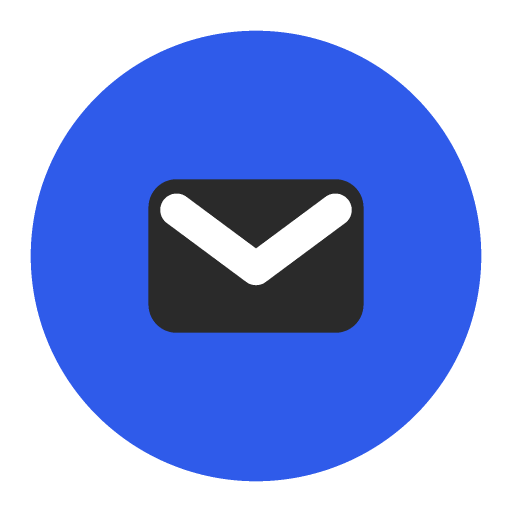
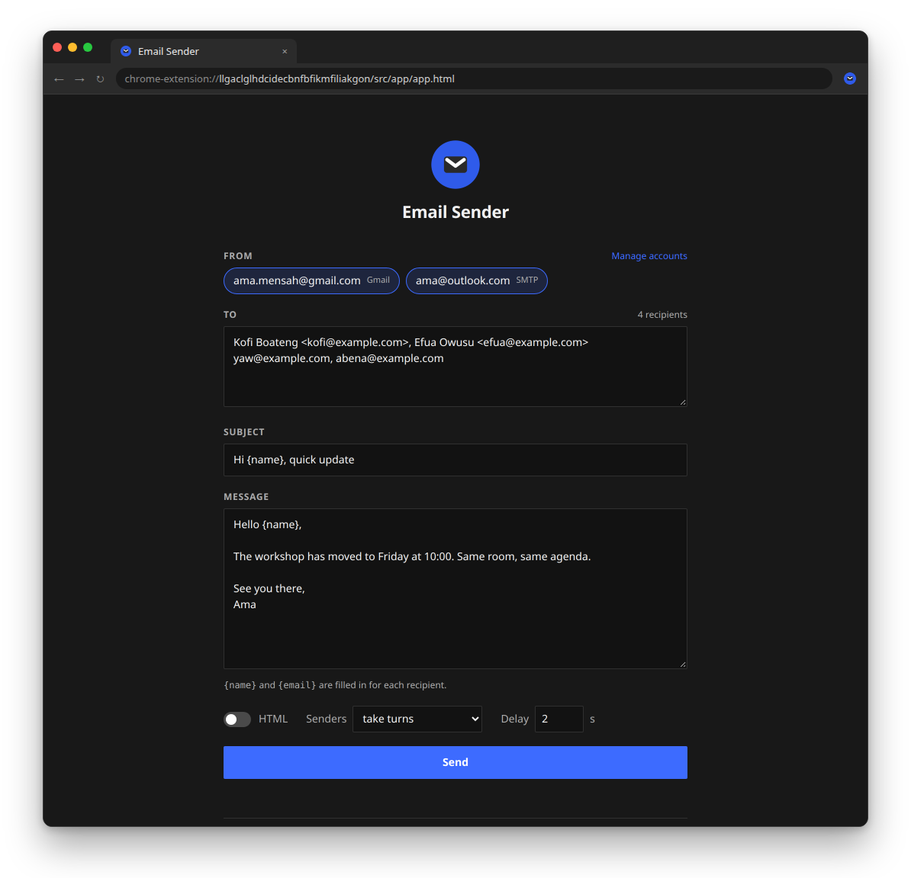

<div align="center">
  
  <h1>Email Sender</h1>
</div>

Email Sender is a minimal extension for sending one email to many people from your own Gmail, Outlook or SMTP accounts. Each recipient gets their own copy, personalised with their name.

<p align="center">
  <a rel="noreferrer noopener" href="https://github.com/Qharny/email/releases/latest/download/email-sender-extension.zip">
    
  </a>
  <a rel="noreferrer noopener" href="#installation-chrome-microsoft-edge-or-brave">
    
  </a>
  <a rel="noreferrer noopener" href="#installation-chrome-microsoft-edge-or-brave">
    
  </a>
  <a rel="noreferrer noopener" href="#installation-chrome-microsoft-edge-or-brave">
    
  </a>
</p>

<p align="center">
  
</p>

## Installation (Chrome, Microsoft Edge or Brave)
- **[Download](https://github.com/Qharny/email/releases/latest/download/email-sender-extension.zip)** the zip from the GitHub Releases and **unzip it**, or **clone this repo** and use the `extension` folder.
- **Open the extensions page**: `chrome://extensions` (Edge: `edge://extensions`, Brave: `brave://extensions`).
- If you did not do it already, **toggle "Developer mode"**. This is usually a toggle at the top right of the extensions page.
- Click **_Load unpacked_**.
- In the window that pops up, **select the unzipped folder**, then **click _Select_**.
- **Done!** Click the _Email Sender_ icon in the toolbar, then **Open composer**.

## Sending from Gmail
Gmail accounts sign in with Google and send through the Gmail API. This needs a free Google OAuth client ID, set up once:
- In **[Google Cloud Console](https://console.cloud.google.com/)**, create a project and **enable the Gmail API** (_APIs & Services → Library_).
- **Configure the OAuth consent screen** as _External_, add the scope `.../auth/gmail.send`, and **add every Gmail address that will send as a test user**.
- **Create an OAuth client ID** (_Credentials → Create credentials_) of type _Web application_ with this authorized redirect URI:
  ```
  https://llgaclglhdcidecbnfbfikmfiliakgon.chromiumapp.org/
  ```
- **Paste the client ID** into the composer under _Settings_, then click **Sign in with Google** under _Accounts_.

While the consent screen is in _Testing_, only listed test users (up to 100) can sign in and Google shows an "unverified app" notice. To ship a build with the client ID pre-filled, set `GOOGLE_CLIENT_ID` in `extension/src/lib/config.js`.

## Sending from Outlook, Yahoo or other accounts
Browsers can't talk to mail servers directly, so these accounts send through a small companion app on your computer (Python 3.9+, nothing to install):
- **[Download](https://github.com/Qharny/email/releases/latest/download/email-sender.zip)** the companion app and **unzip it**.
- **Run** `python3 app.py` (Windows: `py app.py`). It also opens a standalone web version at `http://127.0.0.1:8025`.
- In the composer, open _Accounts → Add Outlook, Yahoo or another SMTP account_ and **use an app password**, not your normal password. Gmail: [myaccount.google.com/apppasswords](https://myaccount.google.com/apppasswords); Outlook, Yahoo and iCloud have the same option in their security settings.

The popup and _Settings_ show whether the companion app is connected.

## Good to know
- **Recipients**: one per line or comma-separated; write `Jane Doe <jane@example.com>` to fill `{name}`. Duplicates and invalid addresses are skipped.
- **Several senders**: they either _take turns_ (recipients are split between them) or _all send to everyone_.
- **Limits**: providers cap daily sending (Gmail: about 500 recipients a day). Keep a delay of a few seconds and only email people who expect it.
- **Privacy**: Gmail tokens and settings stay in the extension's local storage. SMTP passwords stay in `senders.json` next to `app.py` (owner-only, git-ignored), and the companion app only listens on `127.0.0.1`.

## Development
```bash
python3 -m unittest discover -s tests -v   # companion app
node --test tests/js/lib.test.mjs          # extension
```
Load the `extension` folder with **_Load unpacked_** to try changes. To release, bump `version` in `extension/manifest.json` and push a matching tag (e.g. `v1.3.0`); GitHub Actions runs the tests and publishes the zips.

### Related

Design inspired by [Minimal YouTube](https://github.com/ephraimduncan/minimal-youtube).
